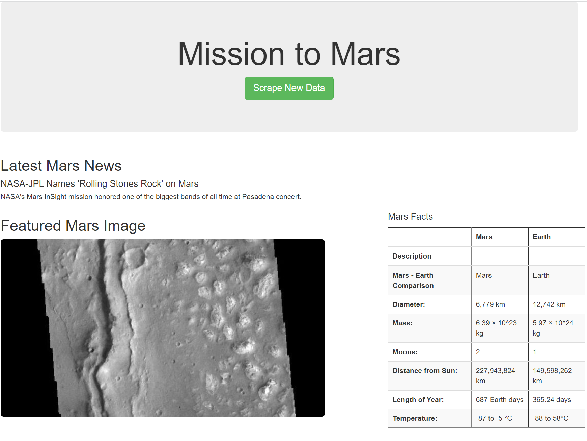
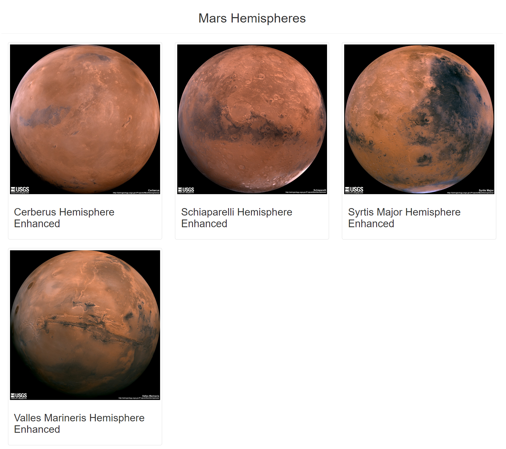
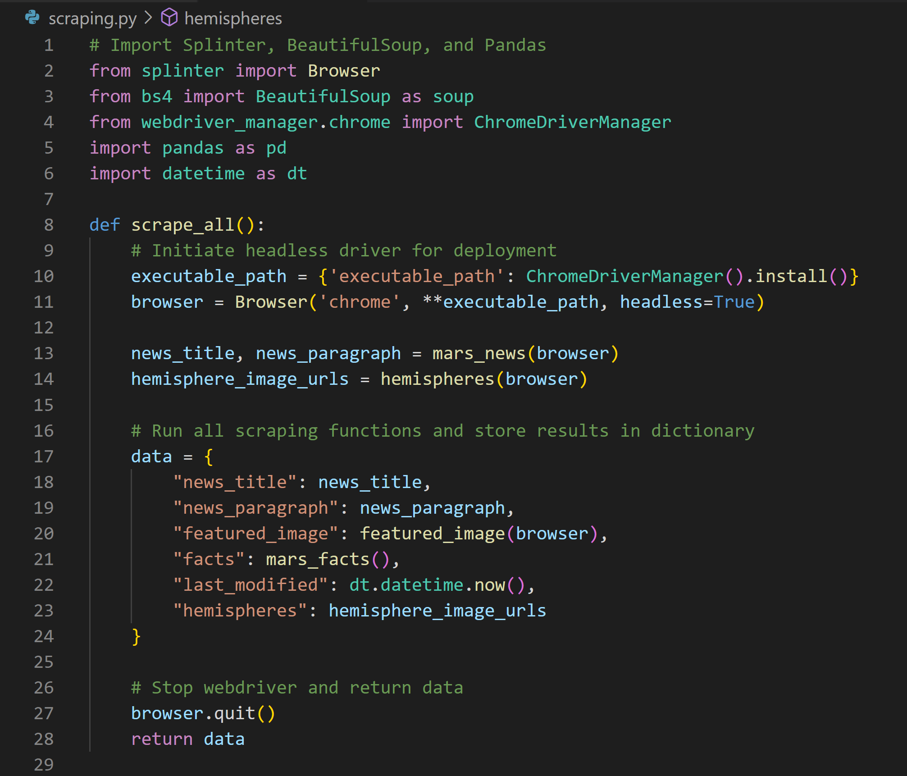
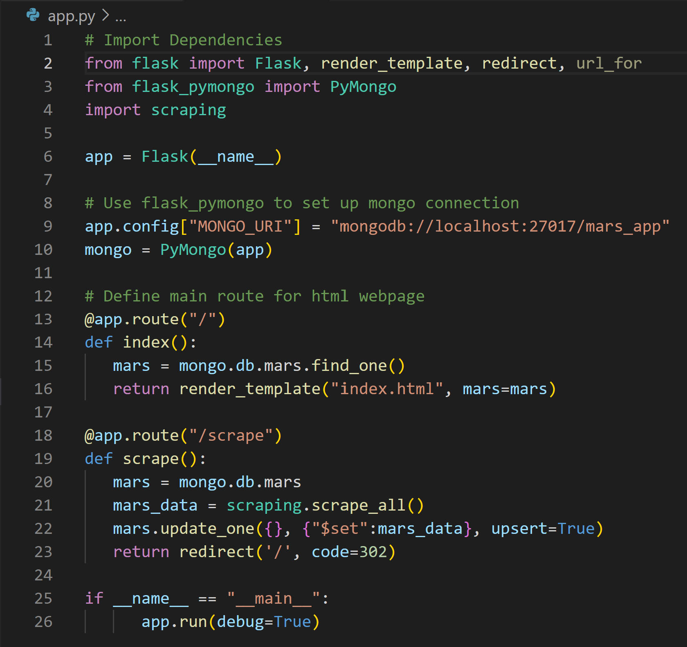
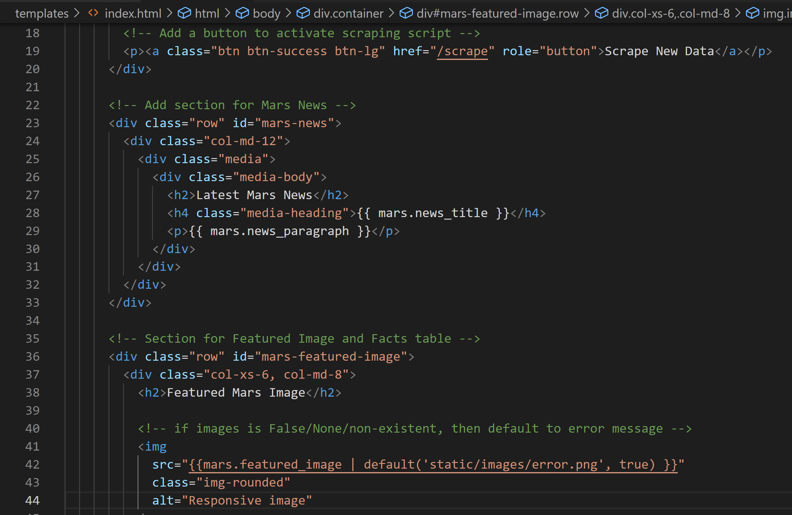

# Mission-to-Mars

## Overview of the Surfs-Up Analysis

We are helping Robin, a junior data scientist, write a script that gathers data for the mission to Mars and present it using a web application.  We used Python (BeautifulSoup and Splinter) to scrape the data from the Mars website.  We then used MongoDB to store the text, images, and table.  To bring it all together we used Flask and edited an index.html file to bring our work to life.
 
### Resources

* Data Source:  index.html, Mission_to_Mars_Challenge.ipynb
* Software:  Python 3.6.1, Jupyter Notebook (anaconda3), Visual Studio Code, 1.38.1, MongoDB
* Packages:  Pandas, Flask, BeautifulSoup, datetime

## Mars Scrap Results

NOTE:  In addition to making the website mobile-responsive, I made the button green and made the featured image rounded.  I 

### Route Site

Mars News Home Site:

### Route Site #2

Bottom Half of News Site:

## PyBer Analysis Code Snippets

scraping.py:

app.py:

index.html:
